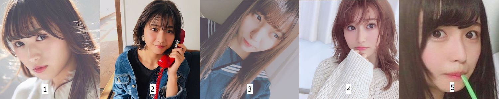

# AIA_taiwan_southern_2nd
臺灣人工智慧學校(AIA)南部分校技術班第二期

## Kaggle 競賽 - CNN Classifier for Identifying Idols
https://www.kaggle.com/c/aia-st2-who-is-she

### Data 
本試題有五位偶像的影像照片, 分別為: 
類別編號: 0, rika
類別編號: 1, risa
類別編號: 2, yui
類別編號: 3, akane
類別編號: 4, neru

### Method
1. Dlib + VGGface extract features
2. Train linear classifier for the extracted features
      
### Result
      - Public Leaderboard: ~93%
      - Privacy Leaderboard: ~87%
